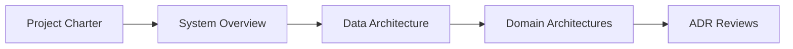
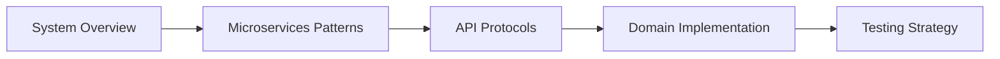
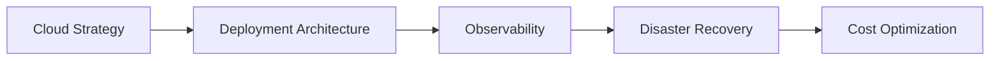
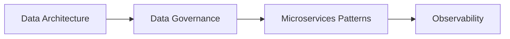
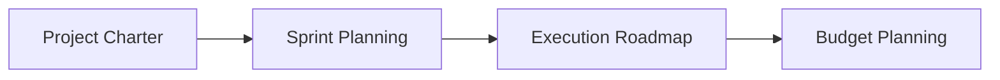

# Documentation Navigation Index

Welcome to the BitVelocity documentation! This comprehensive learning platform is designed for hands-on mastery of modern backend systems, cloud technologies, and data engineering patterns.

## 🚀 Quick Start

**New to the project?** Start here:
1. [Project Charter](00-OVERVIEW/project-charter.md) - Understand the mission and objectives
2. [Stakeholder Guide](00-OVERVIEW/stakeholder-guide.md) - Find your role and relevant documentation
3. [System Overview](01-ARCHITECTURE/system-overview.md) - Understand the overall architecture
4. [Sprint Planning](05-PROJECT-MANAGEMENT/sprint-planning.md) - See the implementation roadmap

## 📁 Documentation Structure

### 00-OVERVIEW - Project Foundation
- [**README.md**](00-OVERVIEW/README.md) - Main project overview and navigation
- [**Project Charter**](00-OVERVIEW/project-charter.md) - Mission, objectives, and constraints
- [**Stakeholder Guide**](00-OVERVIEW/stakeholder-guide.md) - Role-based navigation guide

### 01-ARCHITECTURE - System Design
- [**System Overview**](01-ARCHITECTURE/system-overview.md) - High-level architecture and principles
- [**Data Architecture**](01-ARCHITECTURE/data-architecture.md) - OLTP→OLAP, audit strategy, data governance
- [**Security Architecture**](01-ARCHITECTURE/security-architecture.md) - End-to-end security strategy

#### Domain-Specific Architecture
- [**E-Commerce Domain**](01-ARCHITECTURE/domains/ecommerce/DOMAIN_ECOMMERCE_ARCHITECTURE.md) - Product, orders, inventory, payments
- [**Chat Domain**](01-ARCHITECTURE/domains/chat/DOMAIN_CHAT_ARCHITECTURE.md) - Real-time messaging and notifications
- [**IoT Domain**](01-ARCHITECTURE/domains/iot/DOMAIN_IOT_ARCHITECTURE.md) - Device management and telemetry
- [**Social Domain**](01-ARCHITECTURE/domains/social/DOMAIN_SOCIAL_ARCHITECTURE.md) - Social features and feeds
- [**ML/AI Domain**](01-ARCHITECTURE/domains/ml-ai/DOMAIN_ML_AI_ARCHITECTURE.md) - Machine learning and analytics

### 02-INFRASTRUCTURE - Cloud & Deployment
- [**Cloud Strategy**](02-INFRASTRUCTURE/cloud-strategy.md) - Multi-cloud approach with Pulumi
- [**Deployment Architecture**](02-INFRASTRUCTURE/deployment-architecture.md) - CI/CD and deployment patterns
- [**Cost Optimization**](02-INFRASTRUCTURE/cost-optimization.md) - Budget management and resource optimization

### 03-DEVELOPMENT - Implementation Patterns
- [**Microservices Patterns**](03-DEVELOPMENT/microservices-patterns.md) - Comprehensive pattern implementations
- [**API Protocols Guide**](03-DEVELOPMENT/api-protocols.md) - REST, GraphQL, gRPC, WebSocket, MQTT, etc.
- [**Testing Strategy**](03-DEVELOPMENT/testing-strategy.md) - Testing approaches and automation

### 04-OPERATIONS - Operational Excellence
- [**Observability Strategy**](04-OPERATIONS/observability.md) - Monitoring, logging, tracing
- [**Disaster Recovery**](04-OPERATIONS/disaster-recovery.md) - DR procedures and backup strategies
- [**Data Governance**](04-OPERATIONS/data-governance.md) - Data quality, lineage, compliance

### 05-PROJECT-MANAGEMENT - Execution & Planning
- [**Sprint Planning**](05-PROJECT-MANAGEMENT/sprint-planning.md) - Detailed 2-week sprint cycles
- [**Execution Roadmap**](05-PROJECT-MANAGEMENT/execution-roadmap.md) - Overall implementation timeline
- [**Budget Planning**](05-PROJECT-MANAGEMENT/budget-planning.md) - Cost management and optimization

### ADR - Architectural Decision Records
- [**ADR-001**](adr/ADR-001-multi-repo-vs-monorepo.md) - Repository structure decision
- [**ADR-002**](adr/ADR-002-event-vs-cdc-strategy.md) - Event sourcing vs CDC strategy
- [**ADR-003**](adr/ADR-003-protocol-introduction-order.md) - Protocol learning sequence
- [**ADR-004**](adr/ADR-004-oltp-cdc-olap-architecture.md) - Data architecture decisions
- [**ADR-005**](adr/ADR-005-security-layering.md) - Security architecture approach
- [**ADR-006**](adr/ADR-006-retry-backoff-policies.md) - Resilience patterns
- [**ADR-007**](adr/ADR-007-observability-baseline.md) - Observability strategy
- [**ADR-008**](adr/ADR-008-pulumi-cloud-provider-abstraction.md) - Cloud abstraction approach

## 🎯 Learning Paths by Role

### Software Architects & Technical Leaders

1. [Project Charter](00-OVERVIEW/project-charter.md)
2. [System Overview](01-ARCHITECTURE/system-overview.md)
3. [Data Architecture](01-ARCHITECTURE/data-architecture.md)
4. [Domain Architectures](01-ARCHITECTURE/domains/)
5. [Architectural Decision Records](adr/)

### Backend Developers

1. [System Overview](01-ARCHITECTURE/system-overview.md)
2. [Microservices Patterns](03-DEVELOPMENT/microservices-patterns.md)
3. [API Protocols Guide](03-DEVELOPMENT/api-protocols.md)
4. [Domain-Specific Architecture](01-ARCHITECTURE/domains/)
5. [Testing Strategy](03-DEVELOPMENT/testing-strategy.md)

### Platform Engineers & DevOps

1. [Cloud Strategy](02-INFRASTRUCTURE/cloud-strategy.md)
2. [Deployment Architecture](02-INFRASTRUCTURE/deployment-architecture.md)
3. [Observability Strategy](04-OPERATIONS/observability.md)
4. [Disaster Recovery](04-OPERATIONS/disaster-recovery.md)
5. [Cost Optimization](02-INFRASTRUCTURE/cost-optimization.md)

### Data Engineers

1. [Data Architecture](01-ARCHITECTURE/data-architecture.md)
2. [Data Governance](04-OPERATIONS/data-governance.md)
3. [Microservices Patterns](03-DEVELOPMENT/microservices-patterns.md) (Data sections)
4. [Observability Strategy](04-OPERATIONS/observability.md) (Data monitoring)

### Project Managers

1. [Project Charter](00-OVERVIEW/project-charter.md)
2. [Sprint Planning](05-PROJECT-MANAGEMENT/sprint-planning.md)
3. [Execution Roadmap](05-PROJECT-MANAGEMENT/execution-roadmap.md)
4. [Budget Planning](05-PROJECT-MANAGEMENT/budget-planning.md)

## 📊 Implementation Progress Tracking

### Sprint Progress (12 sprints total)
- ✅ Sprint 1: Foundation Bootstrap
- ⏳ Sprint 2: Event-Driven Core
- ⏳ Sprint 3: Real-time Patterns
- ⏳ Sprint 4: Query Aggregation
- ⏳ Sprint 5: External Integration
- ⏳ Sprint 6: IoT & Messaging
- ⏳ Sprint 7: Stream Processing
- ⏳ Sprint 8: Multi-Region Infrastructure
- ⏳ Sprint 9: Advanced Messaging
- ⏳ Sprint 10: Cloud Portability
- ⏳ Sprint 11: Resilience & Recovery
- ⏳ Sprint 12: Production Hardening

### Technology Coverage
- **Protocols**: REST ✅, GraphQL ⏳, gRPC ⏳, WebSocket ⏳, SSE ⏳, MQTT ⏳, AMQP ⏳, SOAP ⏳
- **Data Stores**: PostgreSQL ✅, Redis ⏳, Kafka ⏳, Cassandra ⏳, MongoDB ⏳
- **Cloud Platforms**: GCP ⏳, AWS ⏳, Azure ⏳
- **Patterns**: CQRS ⏳, Event Sourcing ⏳, Saga ⏳, Circuit Breaker ⏳

## 🔄 Documentation Maintenance

### Recent Changes
- **2024-01**: Complete reorganization and consolidation
- **2024-01**: Added comprehensive data architecture with OLTP→OLAP flows
- **2024-01**: Enhanced budget planning and cost optimization
- **2024-01**: Consolidated microservices patterns documentation

### Contributing Guidelines
1. Follow the existing document structure and naming conventions
2. Update cross-references when adding new documents
3. Maintain consistency with architectural decisions in ADRs
4. Include practical examples and implementation details
5. Update the main index when adding new major sections

## 🆘 Getting Help

### Common Questions
- **"Where do I start?"** → Begin with the [Stakeholder Guide](00-OVERVIEW/stakeholder-guide.md)
- **"What's the budget?"** → See [Budget Planning](05-PROJECT-MANAGEMENT/budget-planning.md)
- **"How are sprints organized?"** → Check [Sprint Planning](05-PROJECT-MANAGEMENT/sprint-planning.md)
- **"What about security?"** → Review [Security Architecture](01-ARCHITECTURE/security-architecture.md)
- **"Where's the data strategy?"** → See [Data Architecture](01-ARCHITECTURE/data-architecture.md)

### Support Channels
- **Technical Questions**: Review relevant ADRs and architecture documents
- **Implementation Issues**: Check microservices patterns and development guides
- **Project Planning**: Consult project management documentation
- **Budget Concerns**: Reference budget planning and cost optimization guides

---

**Last Updated**: January 2024  
**Version**: 2.0 (Post-reorganization)  
**Maintainers**: BitVelocity Architecture Team

*This documentation is a living resource that evolves with the project. Feedback and improvements are always welcome.*