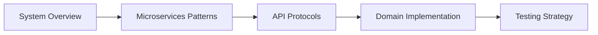
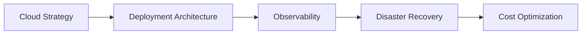
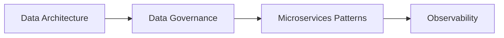

# Documentation Navigation Index

Welcome! This site houses architecture overviews, ADRs, event contracts, and stories that guide implementation.

## 🚀 Quick Start

New to the project? Start with Phases:

- Project Management → [Phases Overview](05-PROJECT-MANAGEMENT/phases/README.md)
- Then pick your current phase (0–9)  
- For reference topics, see [Protocols & Concurrency Reference](stories/REFERENCE-TOPICS.md)

## 📁 Documentation Structure

### 00-OVERVIEW - Project Foundation
- [**README.md**](00-OVERVIEW/README.md) - Main project overview and navigation
- [**Project Charter**](00-OVERVIEW/project-charter.md) - Mission, objectives, and constraints
- [**Stakeholder Guide**](00-OVERVIEW/stakeholder-guide.md) - Role-based navigation guide

### Stories - Execution & Learning
- [Phases](stories/phases/) — Execution phases with integrated learning (0-9)
- [Reference Topics](stories/REFERENCE-TOPICS.md) — Protocol & concurrency reference
- [Quick Start Guide](stories/QUICK-START.md) — Entry point for contributors

### ADR - Architectural Decision Records
- [**ADR-001**](adr/ADR-001-multi-repo-vs-monorepo.md) - Repository structure decision
- [**ADR-002**](adr/ADR-002-event-vs-cdc-strategy.md) - Event sourcing vs CDC strategy
- [**ADR-003**](adr/ADR-003-protocol-introduction-order.md) - Protocol learning sequence
- [**ADR-004**](adr/ADR-004-oltp-cdc-olap-architecture.md) - Data architecture decisions
- [**ADR-005**](adr/ADR-005-security-layering.md) - Security architecture approach
- [**ADR-006**](adr/ADR-006-retry-backoff-policies.md) - Resilience patterns
- [**ADR-007**](adr/ADR-007-observability-baseline.md) - Observability strategy
- [**ADR-008**](adr/ADR-008-pulumi-cloud-provider-abstraction.md) - Cloud abstraction approach

## 🎯 Learning Paths by Role

### Software Architects & Technical Leaders

1. [Project Charter](00-OVERVIEW/project-charter.md)
2. [System Overview](01-ARCHITECTURE/system-overview.md)
3. [Data Architecture](01-ARCHITECTURE/data-architecture.md)
4. [Domain Architectures](01-ARCHITECTURE/domains/)
5. [Architectural Decision Records](adr/)

### Backend Developers

1. Phases → pick your current phase
2. Actionable Build Plan
3. Event Contracts → Guide/README

### Platform Engineers & DevOps

1. [Cloud Strategy](02-INFRASTRUCTURE/cloud-strategy.md)
2. [Deployment Architecture](02-INFRASTRUCTURE/deployment-architecture.md)
3. [Observability Strategy](04-OPERATIONS/observability.md)
4. [Disaster Recovery](04-OPERATIONS/disaster-recovery.md)
5. [Cost Optimization](02-INFRASTRUCTURE/cost-optimization.md)

### Data Engineers

1. [Data Architecture](01-ARCHITECTURE/data-architecture.md)
2. [Data Governance](04-OPERATIONS/data-governance.md)
3. [Microservices Patterns](03-DEVELOPMENT/microservices-patterns.md) (Data sections)
4. [Observability Strategy](04-OPERATIONS/observability.md) (Data monitoring)

### Project Managers

1. Project Charter
2. Phases → Overview and current phase
3. Actionable Build Plan

## 📊 Implementation Progress Tracking

### Sprint Progress (12 sprints total)
- ✅ Sprint 1: Foundation Bootstrap
- ⏳ Sprint 2: Event-Driven Core
- ⏳ Sprint 3: Real-time Patterns
- ⏳ Sprint 4: Query Aggregation
- ⏳ Sprint 5: External Integration
- ⏳ Sprint 6: IoT & Messaging
- ⏳ Sprint 7: Stream Processing
- ⏳ Sprint 8: Multi-Region Infrastructure
- ⏳ Sprint 9: Advanced Messaging
- ⏳ Sprint 10: Cloud Portability
- ⏳ Sprint 11: Resilience & Recovery
- ⏳ Sprint 12: Production Hardening

### Technology Coverage
- **Protocols**: REST ✅, GraphQL ⏳, gRPC ⏳, WebSocket ⏳, SSE ⏳, MQTT ⏳, AMQP ⏳, SOAP ⏳
- **Data Stores**: PostgreSQL ✅, Redis ⏳, Kafka ⏳, Cassandra ⏳, MongoDB ⏳
- **Cloud Platforms**: GCP ⏳, AWS ⏳, Azure ⏳
- **Patterns**: CQRS ⏳, Event Sourcing ⏳, Saga ⏳, Circuit Breaker ⏳

### Contributing Guidelines
1. Follow the existing document structure and naming conventions
2. Update cross-references when adding new documents
3. Maintain consistency with architectural decisions in ADRs
4. Include practical examples and implementation details
5. Update the main index when adding new major sections

## 🆘 Getting Help

### Common Questions
- **"Where do I start?"** → Begin with the [Stakeholder Guide](00-OVERVIEW/stakeholder-guide.md)
- **"What's the budget?"** → See [Budget Planning](05-PROJECT-MANAGEMENT/budget-planning.md)
- **"How are phases organized?"** → Check [Phases Overview](stories/phases/)
- **"What about security?"** → Review [Security Architecture](01-ARCHITECTURE/security-architecture.md)
- **"Where's the data strategy?"** → See [Data Architecture](01-ARCHITECTURE/data-architecture.md)

### Support Channels
- **Technical Questions**: Review relevant ADRs and architecture documents
- **Implementation Issues**: Check microservices patterns and development guides
- **Project Planning**: Consult project management documentation
- **Budget Concerns**: Reference budget planning and cost optimization guides

---

## Layered Dependency Contract (Do Not Violate)
Shared Libs ← (used by) All Domains  
Security Platform ← (used by) All Domains  
E-Commerce Events → consumed by others (but Order svc never imports Chat code etc.)  
Cross-cutting docs define invariants; domain docs must not redefine them.

Quick links
- Phases: stories/phases/
- Reference Topics: stories/REFERENCE-TOPICS.md
- ADRs: adr/
- Event Contracts: event-contracts/