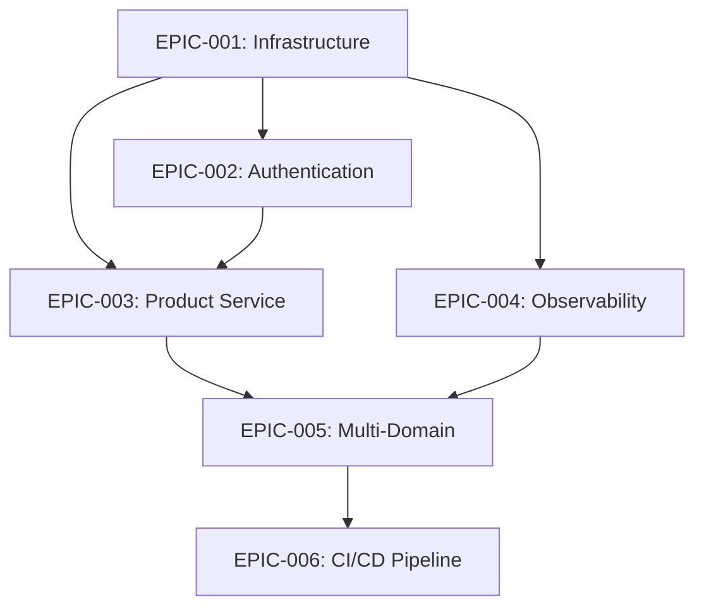

# BitVelocity - Master Epic & Story Backlog

**Project**: BitVelocity Multi-Domain Distributed Learning Platform  
**Total Story Points**: 68  
**Sprint Duration**: 2-3 weeks per sprint  
**Team Capacity**: 40-60 story points per sprint (2-3 developers)

---

## 📋 **EPIC 1: Infrastructure Foundation**
**Epic ID**: EPIC-001  
**Priority**: High  
**Story Points**: 13  
**Sprint**: Sprint 1  
**Status**: Not Started

### Epic Objective
Establish foundational infrastructure and development environment for the BitVelocity platform.

### Success Criteria
- [ ] Monorepo structure with shared libraries established
- [ ] Local development environment (Docker Compose + Kind) functional
- [ ] Developers can set up environment in under 30 minutes
- [ ] Shared libraries properly configured and reusable
- [ ] Complete setup documentation available

### User Stories

#### US-001: Consistent Development Environment Setup
**Story Points**: 13  
**Sprint**: Sprint 1  
**Priority**: High

**Story**: As a developer, I want a consistent development environment so that I can quickly set up and contribute to the BitVelocity platform.

**Acceptance Criteria**:
- [ ] Maven parent POM manages all dependencies and versions
- [ ] Shared libraries (entities, events, security) are configured
- [ ] Docker Compose provides PostgreSQL, Redis, Kafka services
- [ ] Kind cluster configured for Kubernetes development
- [ ] Setup documentation enables 30-minute environment setup

**Tasks**:
1. Set up Maven monorepo structure (3 pts)
2. Configure shared libraries (3 pts)
3. Create Docker Compose infrastructure (2 pts)
4. Setup Kind cluster configuration (3 pts)
5. Document development setup (2 pts)

---

## 🔐 **EPIC 2: Authentication Service**
**Epic ID**: EPIC-002  
**Priority**: High  
**Story Points**: 21  
**Sprint**: Sprint 1  
**Status**: Not Started

### Epic Objective
Implement secure authentication service with JWT tokens, user management, and role-based access control.

### Success Criteria
- [ ] JWT token generation and validation implemented
- [ ] User registration and login endpoints functional
- [ ] Password security meets industry standards (bcrypt, complexity)
- [ ] Role-based access control (RBAC) implemented
- [ ] Performance requirement: 100 requests/second
- [ ] Security audit passes with no critical issues

### User Stories

#### US-002: Secure Authentication System
**Story Points**: 21  
**Sprint**: Sprint 1  
**Priority**: High

**Story**: As a system administrator, I want a secure authentication system so that users can safely access the BitVelocity platform.

**Acceptance Criteria**:
- [ ] JWT token generation and validation works correctly
- [ ] User registration with secure password validation
- [ ] Login endpoint returns valid JWT tokens
- [ ] BCrypt password hashing with complexity rules
- [ ] Role-based access control restricts access by user roles
- [ ] Rate limiting prevents brute force attacks

**Tasks**:
1. Implement JWT token service (5 pts)
2. Create user registration endpoint (4 pts)
3. Implement login endpoint (4 pts)
4. Add password security (bcrypt, validation) (3 pts)
5. Implement RBAC system (5 pts)

---

## 📦 **EPIC 3: Product Service**
**Epic ID**: EPIC-003  
**Priority**: High  
**Story Points**: 18  
**Sprint**: Sprint 2  
**Status**: Not Started

### Epic Objective
Build comprehensive product catalog management service with CRUD operations and data validation.

### Success Criteria
- [ ] Product entity with audit fields implemented
- [ ] REST API with full CRUD operations (GET, POST, PUT, DELETE)
- [ ] Data validation and error handling implemented
- [ ] Database integration with proper migrations
- [ ] Performance requirement: 1000 products searchable in <500ms
- [ ] API documentation complete and accurate

### User Stories

#### US-003: Product Catalog Management
**Story Points**: 18  
**Sprint**: Sprint 2  
**Priority**: High

**Story**: As a product manager, I want a product catalog management system so that I can create, update, and manage products.

**Acceptance Criteria**:
- [ ] Product entity with required fields (id, name, description, price)
- [ ] Audit fields track creation and modification
- [ ] REST API provides full CRUD operations
- [ ] Data validation prevents invalid product creation
- [ ] Database schema properly versioned with migrations
- [ ] Repository and service layers follow established patterns

**Tasks**:
1. Design Product entity with audit fields (4 pts)
2. Create REST API controllers with CRUD (4 pts)
3. Implement data validation and error handling (3 pts)
4. Setup database integration and migrations (4 pts)
5. Build repository and service layers (3 pts)

---

## 📊 **EPIC 4: Observability Foundation**
**Epic ID**: EPIC-004  
**Priority**: Medium  
**Story Points**: 16  
**Sprint**: Sprint 2  
**Status**: Not Started

### Epic Objective
Implement comprehensive observability with metrics collection, structured logging, and monitoring.

### Success Criteria
- [ ] Prometheus metrics collection implemented
- [ ] Structured JSON logging with correlation IDs
- [ ] Health check endpoints for all services
- [ ] Grafana dashboards showing key metrics
- [ ] Basic alerting rules for critical conditions
- [ ] Log aggregation and searching capabilities

### User Stories

#### US-004: System Health Visibility
**Story Points**: 16  
**Sprint**: Sprint 2  
**Priority**: Medium

**Story**: As a DevOps engineer, I want comprehensive system health visibility so that I can monitor and troubleshoot the platform.

**Acceptance Criteria**:
- [ ] Prometheus metrics collected from all services
- [ ] Structured JSON logging with correlation IDs
- [ ] Health check endpoints respond with detailed status
- [ ] Grafana dashboards display business and technical metrics
- [ ] Alerting rules configured for critical conditions
- [ ] Logs are searchable and include request tracing

**Tasks**:
1. Implement Prometheus metrics with Micrometer (4 pts)
2. Configure structured logging with Logback (3 pts)
3. Add health check endpoints (3 pts)
4. Create Grafana dashboards (3 pts)
5. Setup alerting rules and notifications (3 pts)

---

## 🌐 **EPIC 5: Multi-Domain Foundation** 
**Epic ID**: EPIC-005  
**Priority**: Medium  
**Story Points**: 22  
**Sprint**: Sprint 3  
**Status**: Backlog

### Epic Objective
Establish multi-domain architecture foundation for Chat, IoT, Social Pulse, and ML/AI domains.

### Success Criteria
- [ ] Event-driven architecture with Kafka messaging
- [ ] Domain-specific service templates created
- [ ] Event contracts following naming conventions
- [ ] Cross-domain communication patterns established
- [ ] Data governance framework implemented

### User Stories

#### US-005: Event-Driven Architecture Setup
**Story Points**: 12  
**Sprint**: Sprint 3  
**Priority**: Medium

**Story**: As an architect, I want event-driven architecture so that domains can communicate asynchronously.

**Acceptance Criteria**:
- [ ] Kafka messaging infrastructure configured
- [ ] Event envelope structure following naming convention
- [ ] Event publishing and subscribing mechanisms
- [ ] Event schema registry for contract management
- [ ] Cross-domain event routing implemented

#### US-006: Domain Service Templates
**Story Points**: 10  
**Sprint**: Sprint 3  
**Priority**: Medium

**Story**: As a developer, I want standardized service templates so that I can quickly bootstrap new domain services.

**Acceptance Criteria**:
- [ ] Service template with common configurations
- [ ] Database migration templates per domain
- [ ] Dockerfile and Kubernetes manifests
- [ ] Testing framework setup (unit, integration)
- [ ] Documentation templates for new services

---

## 🔄 **EPIC 6: CI/CD Pipeline**
**Epic ID**: EPIC-006  
**Priority**: Medium  
**Story Points**: 15  
**Sprint**: Sprint 3  
**Status**: Backlog

### Epic Objective
Implement continuous integration and deployment pipeline for automated testing and deployment.

### Success Criteria
- [ ] GitHub Actions workflow for automated builds
- [ ] Automated testing (unit, integration, security)
- [ ] Container image building and publishing
- [ ] Deployment automation to Kubernetes
- [ ] Environment promotion pipeline (dev → staging → prod)

### User Stories

#### US-007: Automated Build and Test Pipeline
**Story Points**: 8  
**Sprint**: Sprint 3  
**Priority**: Medium

**Story**: As a developer, I want automated build and test pipeline so that code quality is maintained.

#### US-008: Deployment Automation
**Story Points**: 7  
**Sprint**: Sprint 3  
**Priority**: Medium

**Story**: As a DevOps engineer, I want deployment automation so that releases are consistent and reliable.

---

## 📅 **Sprint Planning**

### **Sprint 1** (2-3 weeks, 40-60 story points)
- **EPIC-001**: Infrastructure Foundation (13 pts)
- **EPIC-002**: Authentication Service (21 pts)  
- **Stretch**: Basic observability setup (if time permits)
- **Total**: 34 story points (achievable for 2-3 developers)

### **Sprint 2** (2-3 weeks, 40-60 story points)  
- **EPIC-003**: Product Service (18 pts)
- **EPIC-004**: Observability Foundation (16 pts)
- **Total**: 34 story points

### **Sprint 3** (2-3 weeks, 40-60 story points)
- **EPIC-005**: Multi-Domain Foundation (22 pts)  
- **EPIC-006**: CI/CD Pipeline (15 pts)
- **Total**: 37 story points

---

## 🎯 **Epic Dependencies**

**Critical Path**: Infrastructure → Authentication → Product Service → Multi-Domain Foundation

---

## 📊 **Summary**
- **Total Epics**: 6
- **Total User Stories**: 8  
- **Total Story Points**: 105
- **Estimated Duration**: 6-9 weeks (3 sprints)
- **Team Size**: 2-3 developers
- **Sprint Capacity**: 40-60 story points per sprint

This backlog provides a logical progression from infrastructure foundation through authentication, core services, observability, multi-domain architecture, and finally CI/CD automation.